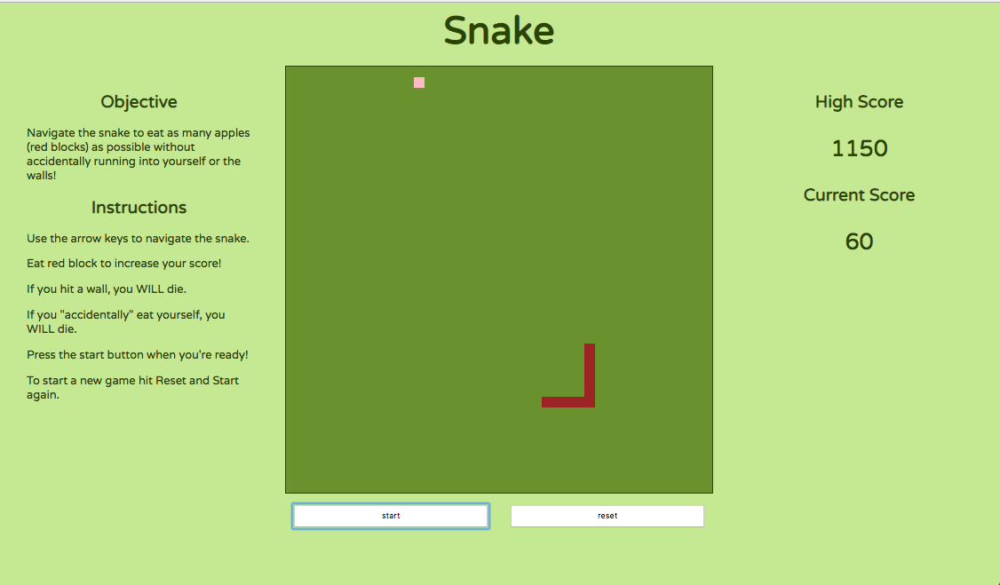

# Snake
### Overview

Web App based off of the game
Snake as seen on Nokia phones circa 1998. Built
with JavaScript and HTML Canvas. Hours to build: 60 hours.

### Learning Goals
HTML5 Canvas, OOP.

### Setup
```
npm install
npm start
```

### Collaborators
[Keeliana Marler](https://github.com/kmarler2/),

### Screenshots
Game play

